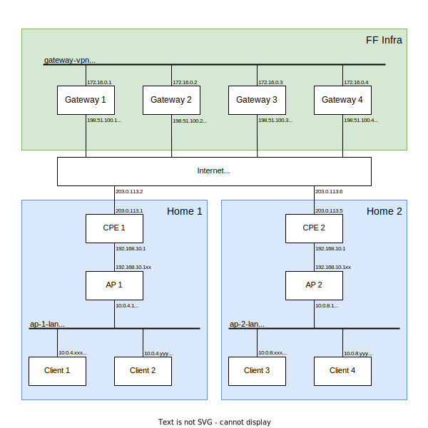

## Overview

This lab setup deploys a full Parker-style network, consisting of:
- Four gateways, each of which runs:
  - WireGuard tunnel termination
  - NAT44 from the internal RFC1918 space to a public IPv4
  - Direct routing of the internal IPv6 space to the internet
  - NAT64 translation from 64:ff9b::/96 to a public IPv4
  - etcd for config/state management
  - The FFBS config tool which serves configuration files to APs and sets up WireGuard peers
  - A "VPN" between gateways for etcd traffic (realized as a shared bridge here)
  - Basic firewalling to protect the VPN and the gateway itself
- Two homes, each of which has:
  - A CPE (representing a typical home router), which has an IPv4 internet uplink, a LAN with a DHCP server and NAT44 between them
  - An AP running a Parker-enabled Gluon image, whose WAN port is connected to the CPE LAN
  - Two clients, which are connected to the AP's LAN port and run a DHCP client
- An "internet" container which runs BGP peering with the gateways and has static links to the CPEs



On top of that, there's some scripting in the AP container to automatically configure them by setting hostname, config server, SSH key and rebooting out of config mode.

The Gateways and APs are set up as VMs, while the other functions (internet, CPE, client) are pure containers.
Since containerlab is built around containers, those VMs are packaged as a container as well.

The AP image is an unmodified Gluon build, while the Gateway images are built using Packer by taking an official Ubuntu Cloud image and running Ansible on it.

For a real gateway setup, the "lab-net" role in Ansible should be adjusted/replaced. For example, the VPN would be an actual VPN there, not a Linux bridge,
and the BGP peering would need to be adjusted for the actual peer router.

## Relevant IPs
### IPv4
- `203.0.113.0/24`: Sample ISP
  - `203.0.113.0/30`: First home
    - `203.0.113.1`: CPE side of the link
    - `203.0.113.2`: Internet side of the link
  - `203.0.113.4/30`: Second home
    - `203.0.113.5`: CPE side of the link
    - `203.0.113.6`: Internet side of the link
  - `203.0.113.42`: The "internet" container itself (useful target for pinging from a client to see if end-to-end connectivity works)
- `198.51.100.0/24`: Public Freifunk IPv4 range
  - `198.51.100.1-14`: The public IPs of the four gateways, used for the WireGuard tunnels and for the public end of NAT44
  - `198.51.100.11-14`: The public IPs of the NAT64 translator on the four NAT64 gateways
- `10.0.0.0/16`: Private Freifunk IPv4 range
  - `10.0.0.1-4`: The private IPs of the four gateways
  - `10.0.4.0/22`: The first AP block, assigned to whichever one asks first
    - `10.0.4.1`: The first AP
  - `10.0.8.0/22`: The second AP block, assigned to whichever one asks second
    - `10.0.8.1`: The second AP
  - ... (more APs)
- `172.16.0.0/24`: The gateway VPN
  - `172.16.0.1-4`: The four gateways
- `192.168.10.0/24`: The home LANs
  - `192.168.10.1`: The CPE
  - `192.168.10.100-199`: The clients (e.g. the AP's WAN port)

### IPv6
- `2001:db8:ff00::/48`: Public Freifunk IPv6 range
  - `2001:db8:ff00::/64`: Freifunk Infrastructure
    - `2001:db8:ff00::1-4`: The four gateways
    - `2001:db8:ff00::1:1-4`: The four NAT64 translators (for e.g. traceroute)
  - `2001:db8:ff00:1::/64`: The first AP block, assigned to whichever one asks first
    - `2001:db8:ff00:1::1`: The first AP
  - `2001:db8:ff00:2::/64`: The second AP block, assigned to whichever one asks second
    - `2001:db8:ff00:2::1`: The first AP
  - ... (more APs)
- `2001:db8:cafe::1`: The "internet" container itself (useful target for pinging from a client to see if end-to-end connectivity works)
- `64:ff9b::/96`: The NAT64 prefix
  - `64:ff9b::203.0.113.42`: Example of a IPv6-mapped public IPv4 address, should be pingable from clients

## Setup steps

- ensure you have about 96GB of available disk space
- Install Packer, Ansible, docker, qemu-utils and containerlab
- Set up bridges (exposed to the host for flexibility):
```
sudo ip link add ap-1-lan type bridge
sudo ip link add ap-2-lan type bridge
sudo ip link add gateway-vpn type bridge
sudo ip link set ap-1-lan up
sudo ip link set ap-2-lan up
sudo ip link set gateway-vpn up
```
- Build containers:
  - Create `gateway/packer/ffbs-ansible/.vault` containing the Ansible Vault password
  - Download x86-64 Gluon image, extract `gluon-ffmuc-<version>-x86-64.img` into `gluon/`
  - Run `./build.sh`
- Bring containerlab up: `sudo containerlab deploy`
- Check the state:
  - For serial on gateway: `docker exec -it clab-ffmuc-gateway-gw02 telnet 127.0.0.1 5000`
    - the user name and password is ubuntu and ffmuc (see `gateway/packer/gateway.pkr.hcl`)
  - For FRR console on internet: `docker exec -it clab-ffmuc-internet vtysh`
  - For serial on AP (after setup has completed): `docker exec -it clab-ffmuc-ap-1 telnet 127.0.0.1 5000`
  - For shell on client: `docker exec -it clab-ffmuc-client-1 bash`
- Bring containerlab down: `sudo containerlab destroy`


## TODOs
- Configure hostname on gateways
- Containerize the gateway?
  - Network container (sets up interfaces, firewall and routing)
  - Mgmt container (runs the config daemon and etcd)
- Enable nat46 on the APs, make the WireGuard mesh v6-only and disable NAT44 on Gateways
  - Currently can be enabled on an AP like this (assuming AP-1):

Make sure that the content of `cat gateway/packer/ffbs-ansible/files/node-config.pub` is the same as on the gluon nodes in `/etc/parker/node-config-pub.key` for it to work.

```
modprobe nat46
echo add clat > /proc/net/nat46/control
echo config clat local.style RFC6052 > /proc/net/nat46/control
# Cut local prefix out of our /64 so that traffic will be routed back to us.
# Not very clean, but good enough for now.
# Long-term this should be handled separately.
echo config clat local.v6 2001:db8:ff00:1:0:64::/96 > /proc/net/nat46/control
echo config clat local.v4 0.0.0.0/0 > /proc/net/nat46/control
echo config clat remote.style RFC6052 > /proc/net/nat46/control
echo config clat remote.v6 64:ff9b::/96 > /proc/net/nat46/control
echo config clat remote.v4 0.0.0.0/0 > /proc/net/nat46/control
ip link set clat up
ip route add 2001:db8:ff00:1:0:64::/96 dev clat
# noderoute.sh keeps resetting the default route, so override it with more-specific routes
ip route add 0.0.0.0/1 dev clat
ip route add 128.0.0.0/1 dev clat
```
